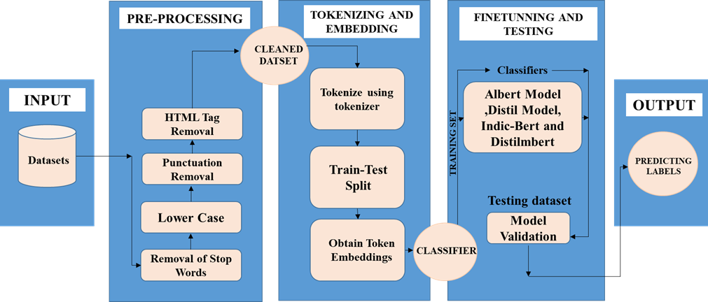
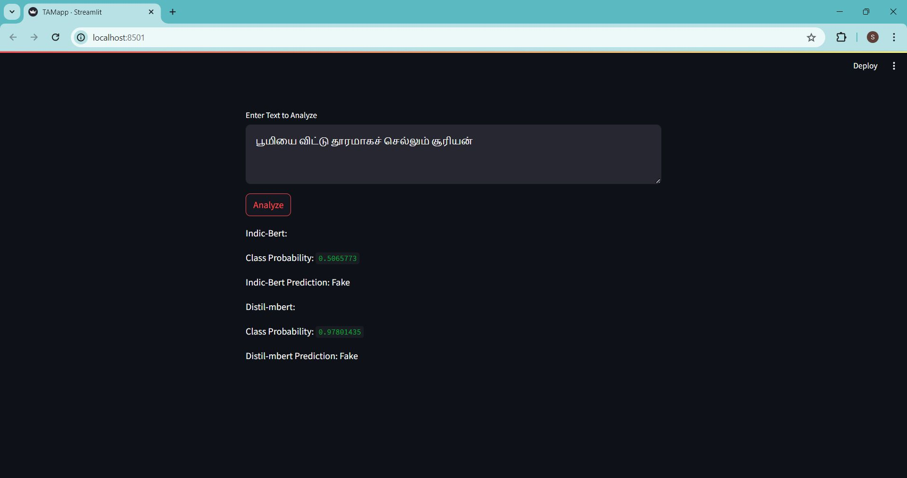

# Fake News Detection for Tamil and English News Articles

## Overview
This project is a multilingual fake news identification system designed to classify news articles written in Tamil and English as either genuine or fake. The application uses advanced Natural Language Processing (NLP) techniques along with Transformer-based deep learning models to improve prediction accuracy and analyze the reliability of news content.

## Table of Contents
- Introduction
- Objective
- System Workflow
- Dataset Collection
- Data Preparation
- Model Development and Evaluation
- How to Run the Project
- User Interface
- Future Scope

## Introduction
The rapid spread of misinformation on online platforms and social media has become a major challenge in modern society. Fake news can create confusion, influence public opinion, and spread false information quickly. This project focuses on building an intelligent system capable of detecting fake news automatically in both Tamil and English languages.

## Objective
The main objective of this project is to:
- Detect misleading or false news articles
- Support multilingual news verification
- Improve the reliability of online information
- Provide users with an easy-to-use verification platform

## System Workflow
## Workflow Diagram


The complete workflow of the project includes:
1. Collecting news datasets
2. Cleaning and preprocessing text data
3. Tokenizing news content
4. Training Transformer-based models
5. Predicting whether news is fake or real
6. Displaying results through a Streamlit web application

## Dataset Collection
Datasets were gathered from publicly available sources such as Kaggle and online news datasets.

### Dataset Details
- English News Articles: 16,527
- Tamil News Articles: 5,227

### Categories Included
- Politics
- Healthcare
- Sports
- Entertainment
- COVID-19
- Current Affairs

## Data Preparation
Several preprocessing steps were performed before model training:

- Converting text to lowercase
- Removing punctuation and unwanted symbols
- Stopword elimination
- Tokenization
- Text vectorization
- Dataset balancing for better model performance

## Model Development and Evaluation

### Models Used

#### English Language Models
- DistilBERT
- ALBERT

#### Tamil Language Models
- DistilMBERT
- IndicBERT

### Accuracy Results

Model & Accuracy 

DistilBERT | 85.69% 
ALBERT     | 85.14% 
DistilMBERT| 82.02% 
IndicBERT  | 75.81% 

The trained models achieved good accuracy in identifying fake news content across both languages.

## Technologies Used
- Python
- Streamlit
- Transformers
- TensorFlow / PyTorch
- NLP Techniques

## How to Run the Project

### Clone the Repository

```bash
git clone https://github.com/psdivyakumar/Fake-news-detection.git
```

### Open the Project Folder

```bash
cd Fake-news-detection
```

### Install Required Packages

```bash
pip install -r requirements.txt
```

### Run the Application

```bash
streamlit run ENGapp.py
```

or

```bash
streamlit run TAMapp.py
```

## User Interface
The project includes a simple and interactive Streamlit interface where users can:
- Enter news content
- Verify authenticity
- Receive prediction results instantly

## User Interface




## Future Scope
The project can be further improved by adding:

- Real-time news verification
- Image and video-based fake news detection
- Social media integration
- Continuous model retraining
- Support for additional regional languages


## Conclusion
This project demonstrates how Transformer-based NLP models can be effectively used for multilingual fake news detection. The system helps users identify misleading information and contributes toward promoting trustworthy digital content.
